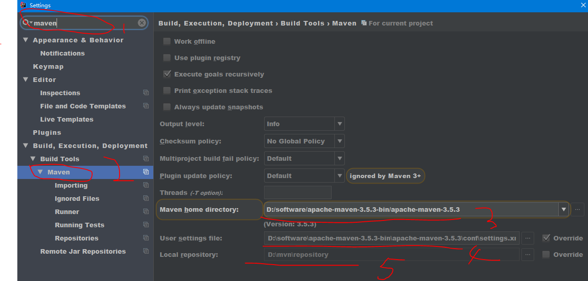
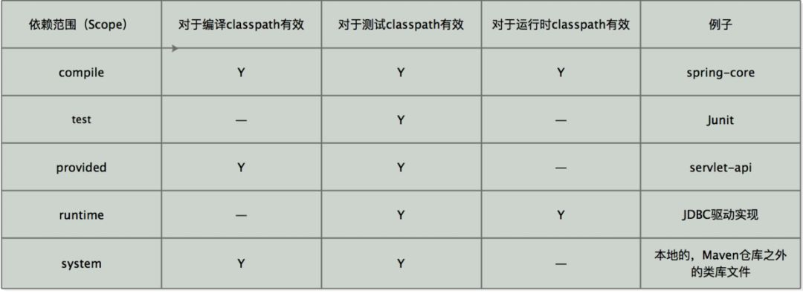
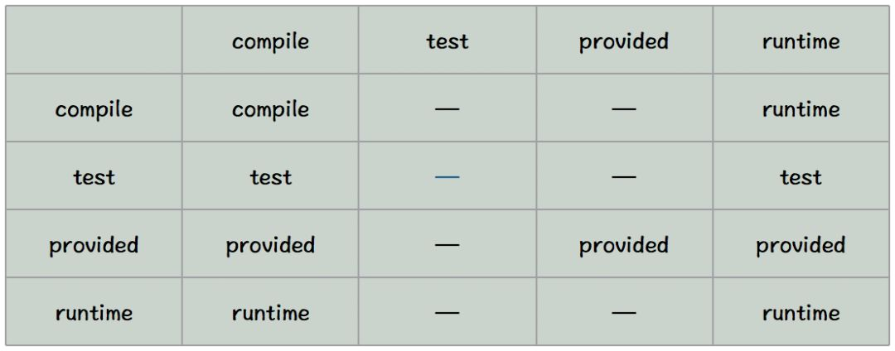
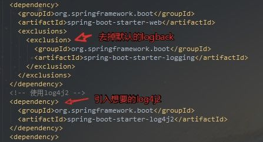
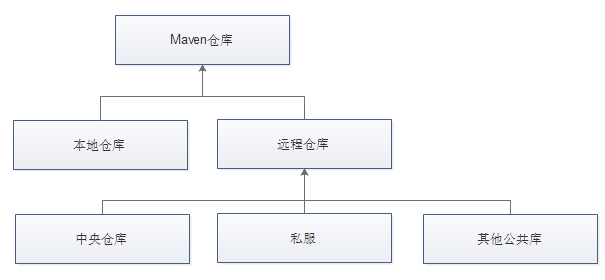

Maven学习笔记
=========
一.介绍
-------
Maven作为一个***构建工具***，不仅能帮我们自动化构建，还能够抽象构建过程，提供构建任务实现;它跨平台，对外提供了一致的操作接口，这一切足以使它成为优秀的、流行的构建工具。
Maven不仅是构建工具，还是一个***依赖管理工具和项目管理工具***，它提供了中央仓库，能帮我自动下载构件。 

二.安装
-------
1. 确认是否安装了jdk
2. 官网下载对应操作系统的maven版本
3. 设置一下环境变量，将Maven安装配置到操作系统环境中，主要就是配置M2_HOME *和PATH*两项
4. 验证是否安装成功 mvn -v

三.目录介绍
-------
1. bin目录:该目录包含了mvn运行的脚本，这些脚本用来配置java命令，准备好classpath和相关的Java系统属性，然后执行Java命令。
2. boot目录:该目录只包含一个文件，该文件为plexus-classworlds-2.5.2.jar。plexus-classworlds是一个类加载器框架，相对于默认的java类加载器，它提供了更加丰富的语法以方便配置，Maven使用该框架加载自己的类库。 
3. conf目录:该目录包含了一个非常重要的文件settings.xml。直接修改该文件，就能在机器上全局地定制Maven的行为，一般情况下，我们更偏向于复制该文件至~/.m2/目录下（~表示用户目录），然后修改该文件，在用户范围定制Maven的行为。
4. lib目录:该目录包含了所有Maven运行时需要的Java类库，Maven本身是分模块开发的，因此用户能看到诸如maven-core-3.0.jar、maven-model-3.0.jar之类的文件，此外这里还包含一些Maven用到的第三方依赖如commons-cli-1.2.jar、commons-lang-2.6.jar等等。

四.Maven常用命令说明
-------
1. mvn clean：表示运行清理操作（会默认把target文件夹中的数据清理）。
2. mvn clean compile：表示先运行清理之后运行编译，会将代码编译到target文件夹中。
3. mvn clean test：运行清理和测试。
4. mvn clean package：运行清理和打包。
5. mvn clean install：运行清理和安装，会将打好的包安装到本地仓库中，以便其他的项目可以调用。
6. mvn clean deploy：运行清理和发布（发布到私服上面）。
上面的命令大部分都是连写的，大家也可以拆分分别执行，这是活的，看个人喜好以及使用需求，Eclipse Run as对maven项目会提供常用的命令。
执行maven命令必须进入到pom.xml的目录中进行执行
五.设置http代理
------
```cmd
<settings>  
  ...
  <proxies>
    <proxy>  
      <id>my-proxy</id>  
      <active>true</active>  
      <protocol>http</protocol>  
      <host>218.14.227.197</host>  
      <port>3128</port>  
      <!--  
        <username>***</username>  
        <password>***</password>  
        <nonProxyHosts>  
          repository.mycom.com|*.google.com  
        </nonProxyHosts>  
      -->  
    </proxy>  
  </proxies>  
  ...  
</settings> 
```

六、Maven插件安装，基于IDEA
----

11111

七、依赖范围
----
依赖范围就是用来控制依赖和三种classpath(编译classpath，测试classpath、运行classpath)的关系，Maven有如下几种依赖范围： 
- compile:编译依赖范围。如果没有指定，就会默认使用该依赖范围。使用此依赖范围的Maven依赖，对于编译、测试、运行三种classpath都有效。典型的例子是spring-code,在编译、测试和运行的时候都需要使用该依赖。 
- test: 测试依赖范围。使用次依赖范围的Maven依赖，只对于测试classpath有效，在编译主代码或者运行项目的使用时将无法使用此依赖。典型的例子是Jnuit,它只有在编译测试代码及运行测试的时候才需要。 
- provided:已提供依赖范围。使用此依赖范围的Maven依赖，对于编译和测试classpath有效，但在运行时候无效。典型的例子是servlet-api,编译和测试项目的时候需要该依赖，但在运行项目的时候，由于容器以及提供，就不需要Maven重复地引入一遍。 
- runtime:运行时依赖范围。使用此依赖范围的Maven依赖，对于测试和运行classpath有效，但在编译主代码时无效。典型的例子是JDBC驱动实现，项目主代码的编译只需要JDK提供的JDBC接口，只有在执行测试或者运行项目的时候才需要实现上述接口的具体JDBC驱动。 
- system:系统依赖范围。该依赖与三种classpath的关系，和provided依赖范围完全一致，但是，使用system范围的依赖时必须通过systemPath元素显示地指定依赖文件的路径。由于此类依赖不是通过Maven仓库解析的，而且往往与本机系统绑定，可能构成构建的不可移植，因此应该谨慎使用。systemPath元素可以引用环境变量，如：
- import:导入依赖范围。该依赖范围不会对三种classpath产生实际的影响。 上述除import以外的各种依赖范围与三种classpath的关系如下

 
 
 八、传递依赖范围
 ----
 假设A依赖于B,B依赖于C，我们说A对于B是第一直接依赖，B对于C是第二直接依赖，A对于C是传递性依赖。第一直接依赖和第二直接依赖的范围决定了传递性依赖的范围，如下图所示，最左边一行表示第一直接依赖范围，最上面一行表示第二直接依赖范围，中间的交叉单元格则表示传递依赖范围。
 从上图中，我们可以发现这样的规律： 
 - 当第二直接依赖的范围是compile的时候，传递性依赖的范围与第一直接依赖的范围一致； 
 - 当第二直接依赖的范围是test的时候，依赖不会得以传递； 
 - 当第二直接依赖的范围是provided的时候，只传递第一直接依赖范围也为provided的依赖，切传递依赖的范围同样为provided; 
 - 当第二直接依赖的范围是runtime的时候，传递性依赖的范围与第一直接依赖的范围一致，但compile列外，此时传递性依赖范围为runtime.
 
 
 九、依赖调解
 ---
 有时候，当传递性依赖造成为题的时候，就需要清楚地知道该传递性依赖是从哪条依赖路径引入的。这就是依赖调解的作用，依赖调解有两大原则：
 1. 路径最近者优先 比如项目有A有这样的依赖关系：A->B->C->X(1.0)、A->D->X(2.0),X是A的传递性依赖，但是两条依赖路径上有两个版本的X，所以根据第一原则，A->D->X(2.0)路径短，所以X(2.0)会被解析使用 
 2. 第一声明者优先 如果路径都一样长的话，第一原则就不行了，比如 A->B->Y(1.0)、A->C->Y(2.0),Y(1.0)和Y(2.0)的路径一样，所以这时候根据第二原则，先声明的被解析。
 
 十、 可选依赖
 ---
 如图，项目中A依赖B，B依赖于X和Y，如果所有这三个的范围都是compile的话，那么X和Y就是A的compile范围的传递性依赖，但是如果我想X,Y不作为A的传递性依赖，不给他用的话。就需要下面提到的配置可选依赖。
 配置也简单，在依赖里面添加
 ```cmd
   <dependency>
                <groupId>org.springframework.cloud</groupId>
                <artifactId>spring-cloud-dependencies</artifactId>
                <version>${spring.cloud.version}</version>
                <type>pom</type>
                <scope>import</scope>
                <optional>true</optional>
    </dependency>
 ```
就表示可选依赖了，这样A如果想用X,Y就要直接显示的添加依赖了。

十一、 排除依赖
---
有时候你引入的依赖中包含你不想要的依赖包，你想引入自己想要的，这时候就要用到排除依赖了，比如下图中spring-boot-starter-web自带了logback这个日志包，我想引入log4j2的，所以我先排除掉logback的依赖包，再引入想要的包就行了
 
这里注意：声明exclustion的时候只需要groupId和artifactId，而不需要version元素，这是因为只需要groupId和artifactId就能唯一定位依赖图中的某个依赖。

 十二、仓库的分类
 ---
  
  
  十三、 远程仓库的配置
  ---
  在平时的开发中，我们往往不会使用默认的中央仓库，默认的中央仓库访问的速度比较慢，访问的人或许很多，有时候也无法满足我们项目的需求，可能项目需要的某些构件中央仓库中是没有的，而在其他远程仓库中有，如JBoss Maven仓库。这时，可以在pom.xml中配置该仓库，代码如下：
   ```cmd
   <!--远程仓库配置-->
    <repositories>
        <repository>
            <id>nexusc</id>
            <name>Nexus</name>
            <url>https://dev-cv.saicmotor.com/nexus/content/groups/public/</url>
            <releases>
                <enabled>true</enabled>
                <updatePolicy>daily</updatePolicy>
            </releases>
            <snapshots>
                <enabled>true</enabled>
                <checksumPolicy>warn</checksumPolicy>
            </snapshots>
            <layout>default</layout>
        </repository>
    </repositories>
 ```
 - repository:在repositories元素下，可以使用repository子元素声明一个或者多个远程仓库。 
 - id：仓库声明的唯一id，尤其需要注意的是，Maven自带的中央仓库使用的id为central，如果其他仓库声明也使用该id，就会覆盖中央仓库的配置。 
 - name：仓库的名称，让我们直观方便的知道仓库是哪个，暂时没发现其他太大的含义。 
 - url：指向了仓库的地址，一般来说，该地址都基于http协议，Maven用户都可以在浏览器中打开仓库地址浏览构件。 
 - releases和snapshots：用来控制Maven对于发布版构件和快照版构件的下载权限。需要注意的是enabled子元素，该例中releases的enabled值为true，表示开启JBoss仓库的发布版本下载支持，而snapshots的enabled值为false，表示关闭JBoss仓库的快照版本的下载支持。根据该配置，Maven只会从JBoss仓库下载发布版的构件，而不会下载快照版的构件。 
 - layout：元素值default表示仓库的布局是Maven2及Maven3的默认布局，而不是Maven1的布局。基本不会用到Maven1的布局。 - 其他：对于releases和snapshots来说，除了enabled，它们还包含另外两个子元素updatePolicy和checksumPolicy。 
 1：元素updatePolicy用来配置Maven从远处仓库检查更新的频率，默认值是daily，表示Maven每天检查一次。其他可用的值包括：never-从不检查更新；always-每次构建都检查更新；interval：X-每隔X分钟检查一次更新（X为任意整数）。 
 2：元素checksumPolicy用来配置Maven检查校验和文件的策略。当构建被部署到Maven仓库中时，会同时部署对应的检验和文件。在下载构件的时候，Maven会验证校验和文件，如果校验和验证失败，当checksumPolicy的值为默认的warn时，Maven会在执行构建时输出警告信息，其他可用的值包括：fail-Maven遇到校验和错误就让构建失败；ignore-使Maven完全忽略校验和错误。
 
 十四、 远程仓库的认证
 ---
 大部分的远程仓库不需要认证，但是如果是自己内部使用，为了安全起见，还是要配置认证信息的。 配置认证信息和配置远程仓库不同，远程仓库可以直接在pom.xml中配置，但是认证信息必须配置在settings.xml文件中。这是因为pom往往是被提交到代码仓库中供所有成员访问的，而settings.xml一般只存在于本机。因此，在settings.xml中配置认证信息更为安全。
 ```cmd
 <settings>
 <servers>
 <!--配置远程仓库认证信息-->
		<server>
			<id>nexusc</id>
			<username>deployment</username>
			<password>deployment</password>
		</server>
    ...
 <servers>
    
 </settings>
 ```
 这里除了配置账号密码之外，值关键的就是id了，这个id要跟你在pom.xml里面配置的远程仓库repository的id一致，正是这个id将认证信息与仓库配置联系在了一起。
 
 十五、 部署构件至远程仓库
 ----
 我们自己搭建远程仓库的目的就是为了可以方便部署我们自己项目的构件以及一些无法从外部仓库直接获取的构件。这样才能在开发时，供其他对团队成员使用。 Maven除了能对项目进行编译、测试、打包之外，还能将项目生成的构件部署到远程仓库中。首先，需要编辑项目的pom.xml文件。配置distributionManagement元素，代码如下：
 ```cmd
 <distributionManagement>
		<repository>
			<id>releases</id>
			<name>Nexus Release Repository</name>
			<url>https://dev-cv.saicmotor.com/nexus/content/repositories/thirdparty/</url>
		</repository>
		<snapshotRepository>
			<id>snapshots</id>
			<name>Nexus Snapshot Repository</name>
			<url>https://dev-cv.saicmotor.com/nexus/content/repositories/thirdparty-snapshots/</url>
		</snapshotRepository>
	</distributionManagement>
 ```
 看代码，从命名上就看的出来区别，repository表示表示发布版本（稳定版本）构件的仓库，snapshotRepository表示快照版本（开发测试版本）的仓库。这两个元素都需要配置id、name和url，id为远程仓库的唯一标识，name是为了方便人阅读，关键的url表示该仓库的地址。

配置好了就运行命令mvn clean deploy，Maven就会将项目构建输出的构件部署到配置对应的远程仓库，如果项目当前的版本是快照版本，则部署到快照版本的仓库地址，否则就部署到发布版本的仓库地址。 当前项目是快照还是发布版本是通过 true 这个来区分的。忘记的同学在看看上面的## 远程仓库的配置。

十六、镜像
---
如果仓库X可以提供仓库Y存储的所有内容，那么就可以认为X是Y的一个镜像。用过Maven的都知道，国外的中央仓库用起来太慢了，所以选择一个国内的镜像就很有必要，我推荐国内的阿里云镜像。 阿里云镜像：配置很简单，修改conf文件夹下的settings.xml文件，添加如下镜像配置：
```cmd
<!-- 仓库镜像 -->
	<mirrors>
		<mirror>
			<id>nexus</id>
			<name>本地nuxus私服镜像</name>
			<!-- 服务器镜像的URL地址 -->
			<!-- <url>http://121.42.145.73:8081/nexus/content/groups/public/</url> -->
			<!-- <url>http://maven.hexnova.com/nexus/content/groups/hexnova-open</url> -->
			<!-- <url>https://dev-cv.saicmotor.com/nexus/content/repositories/thirdparty</url> -->
			<url>https://dev-cv.saicmotor.com/nexus/content/groups/public</url>
			
			<!-- *号表示是所有的Maven仓库镜像 -->
			<!-- 还可以有以下几种取值：【central】、【repo1,repo2】、【*,!inhouse】、【external:*】 等 -->
			<mirrorOf>*</mirrorOf>
		</mirror>
	</mirrors>
```
上例子中，的值为central,表示该配置为中央库的镜像，任何对于中央仓库的请求都会转至该镜像，用户也可以用同样的方法配置其他仓库的镜像

这里介绍下 <mirrorOf>配置的各种选项 - <mirrorOf>*<mirrorOf>:匹配所有远程仓库。 - <mirrorOf>external:*<mirrorOf>:匹配所有远程仓库，使用localhost的除外，使用file://协议的除外。也就是说，匹配所有不在本机上的远程仓库。 - <mirrorOf>repo1,repo2<mirrorOf>:匹配仓库repo1h和repo2，使用逗号分隔多个远程仓库。 - <mirrorOf>*,!repo1<mirrorOf>:匹配所有远程仓库，repo1除外，使用感叹号将仓库从匹配中排除。

需要注意的是，由于镜像仓库完全屏蔽了被镜像仓库，当镜像仓库不稳定或者停止服务的时候，Maven仍将无法访问被镜像仓库，因而将无法下载构件。

十七、仓库服务搜索
---
这里介绍2个提供仓库服务搜索的地址： 
- Sonatype Nexus：https://repository.sonatype.org/ 
- MVNrepository：http://mvnrepository.com/

十八、书籍推荐
---
<<Maven实战>>

十九、为什么使用Maven这样的构建工具【why】
----
- 一个项目就是一个工程
如果项目非常庞大，就不适合使用package来划分模块，最好是每一个模块对应一个工程，利于分工协作。借助于maven就可以将一个项目拆分成多个工程
- 项目中使用jar包，需要“复制”、“粘贴”项目的lib中
同样的jar包重复的出现在不同的项目工程中，你需要做不停的复制粘贴的重复工作。借助于maven，可以将jar包保存在“仓库”中，不管在哪个项目只要使用引用即可就行。
- jar包需要的时候每次都要自己准备好或到官网下载
借助于maven我们可以使用统一的规范方式下载jar包，规范
- jar包版本不一致的风险
不同的项目在使用jar包的时候，有可能会导致各个项目的jar包版本不一致，导致未执行错误。借助于maven，所有的jar包都放在“仓库”中，所有的项目都使用仓库的一份jar包。
- 一个jar包依赖其他的jar包需要自己手动的加入到项目中
FileUpload组件->IO组件，commons-fileupload-1.3.jar依赖于commons-io-2.0.1.jar
极大的浪费了我们导入包的时间成本，也极大的增加了学习成本。借助于maven，它会自动的将依赖的jar包导入进来。

二十、maven是什么【what】
---
- maven是一款服务于java平台的自动化构建工具
make->Ant->Maven->Gradle
名字叫法：我们可以叫妹文也可以叫麦文，但是没有叫妈文的。
- 构建
构建定义：把动态的Web工程经过编译得到的编译结果部署到服务器上的整个过程。
- 编译：java源文件[.java]->编译->Classz字节码文件[.class]
- 部署：最终在sevlet容器中部署的不是动态web工程，而是编译后的文件
- 构建的各个环节

清理clean：将以前编译得到的旧文件class字节码文件删除


◾编译compile：将java源程序编译成class字节码文件


◾测试test：自动测试，自动调用junit程序


◾报告report：测试程序执行的结果


◾打包package：动态Web工程打War包，java工程打jar包


◾安装install：Maven特定的概念-----将打包得到的文件复制到“仓库”中的指定位置


◾部署deploy：将动态Web工程生成的war包复制到Servlet容器下，使其可以运行

二十一、创建约定的目录结构（maven工程必须按照约定的目录结构创建）
---
```cmd
	  根目录：工程名
	|---src：源码
	|---|---main:存放主程序
	|---|---|---java：java源码文件
	|---|---|---resource：存放框架的配置文件
	|---|---test：存放测试程序
	|---pop.xml：maven的核心配置文件
```

二十二、生命周期　　
---
Maven有三套相互独立的生命周期，请注意这里说的是“三套”，而且“相互独立”，初学者容易将Maven的生命周期看成一个整体，其实不然。这三套生命周期分别是：
- Clean Lifecycle 在进行真正的构建之前进行一些清理工作。Clean生命周期一共包含了三个阶段：
1. pre-clean 执行一些需要在clean之前完成的工作
2. clean 移除所有上一次构建生成的文件
3. post-clean 执行一些需要在clean之后立刻完成的工作

- Default Lifecycle 构建的核心部分，编译，测试，打包，部署等等。

◾validate


◾generate-sources


◾process-sources


◾generate-resources


◾process-resources 复制并处理资源文件，至目标目录，准备打包


◾compile 编译项目的源代码


◾process-classes


◾generate-test-sources


◾process-test-sources


◾generate-test-resources


◾process-test-resources 复制并处理资源文件，至目标测试目录


◾test-compile 编译测试源代码


◾process-test-classes


◾test 使用合适的单元测试框架运行测试。这些测试代码不会被打包或部署


◾prepare-package


◾package 接受编译好的代码，打包成可发布的格式，如 JAR


◾pre-integration-test


◾integration-test


◾post-integration-test


◾verify


◾install 将包安装至本地仓库，以让其它项目依赖。


◾deploy 将最终的包复制到远程的仓库，以让其它开发人员与项目共享
通过日志我们发现，其实执行mvn install，其中已经执行了compile 和 test 。

总结：不论你要执行生命周期的哪一个阶段，maven都是从这个生命周期的开始执行

插件：每个阶段都有插件（plugin），看上面标红的。插件的职责就是执行它对应的命令。

- Site Lifecycle 生成项目报告，站点，发布站点。

pre-site 执行一些需要在生成站点文档之前完成的工作


◾site 生成项目的站点文档


◾post-site 执行一些需要在生成站点文档之后完成的工作，并且为部署做准备


◾site-deploy 将生成的站点文档部署到特定的服务器上

二十三、build配置
---
```cmd
<build>
　　<!-- 项目的名字 -->
　　<finalName>WebMavenDemo</finalName>
　　<!-- 描述项目中资源的位置 -->
　　<resources>
　　　　<!-- 自定义资源1 -->
　　　　<resource>
　　　　　　<!-- 资源目录 -->
　　　　　　<directory>src/main/java</directory>
　　　　　　<!-- 包括哪些文件参与打包 -->
　　　　　　<includes>
　　　　　　　　<include>**/*.xml</include>
　　　　　　</includes>
　　　　　　<!-- 排除哪些文件不参与打包 -->
　　　　　　<excludes>
　　　　　　　　<exclude>**/*.txt</exclude>
　　　　　　　　　　<exclude>**/*.doc</exclude>
　　　　　　</excludes>
　　　　</resource>
　　</resources>
　　<!-- 设置构建时候的插件 -->
　　<plugins>
　　　　<plugin>
　　　　　　<groupId>org.apache.maven.plugins</groupId>
　　　　　　<artifactId>maven-compiler-plugin</artifactId>
　　　　　　<version>2.1</version>
　　　　　　<configuration>
　　　　　　　　<!-- 源代码编译版本 -->
　　　　　　　　<source>1.8</source>
　　　　　　　　<!-- 目标平台编译版本 -->
　　　　　　　　<target>1.8</target>
　　　　　　</configuration>
　　　　</plugin>
　　　　<!-- 资源插件（资源的插件） -->  
　　　　<plugin>  
　　　　　　<groupId>org.apache.maven.plugins</groupId>  
　　　　　　<artifactId>maven-resources-plugin</artifactId>  
　　　　　　<version>2.1</version>  
　　　　　　<executions>  
　　　　　　　　<execution>  
　　　　　　　　　　<phase>compile</phase>  
　　　　　　　　</execution>  
　　　　　　</executions>  
　　　　　　<configuration>  
　　　　　　　　<encoding>UTF-8</encoding>  
　　　　　　</configuration> 
　　　　</plugin>
　　　　<!-- war插件(将项目打成war包) -->  
　　　　<plugin>  
　　　　　　<groupId>org.apache.maven.plugins</groupId>  
　　　　　　<artifactId>maven-war-plugin</artifactId>  
　　　　　　<version>2.1</version>  
　　　　　　<configuration>
　　　　　　　　<!-- war包名字 -->  
　　　　　　　　<warName>WebMavenDemo1</warName>
　　　　　　</configuration>  
　　　　</plugin>  
　　</plugins>
</build>
```


